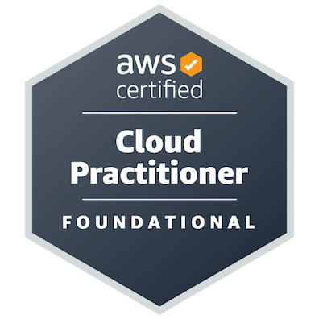
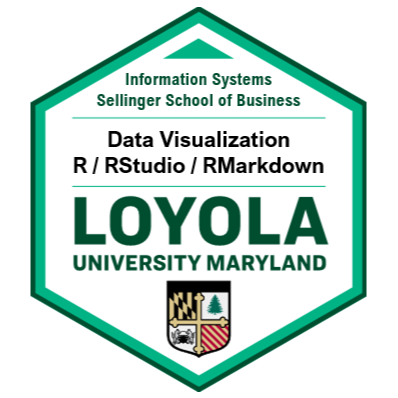
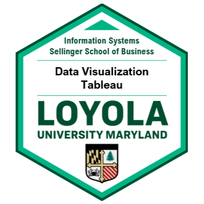

## Hi, I'm Nolan 👋

- 🔭 I’m currently working on personal portfolio website
- 🌱 I’m currently learning QLoRA LLM fine tuning

## 📈 GitHub Stats

<!--

**nolan-clark/nolan-clark** is a ✨ _special_ ✨ repository because its `README.md` (this file) appears on your GitHub profile.

Here are some ideas to get you started:

- 🔭 I’m currently working on ...
- 🌱 I’m currently learning ...
- 👯 I’m looking to collaborate on ...
- 🤔 I’m looking for help with ...
- 💬 Ask me about ...
- 📫 How to reach me: ...
- 😄 Pronouns: ...
- ⚡ Fun fact: ...
-->
